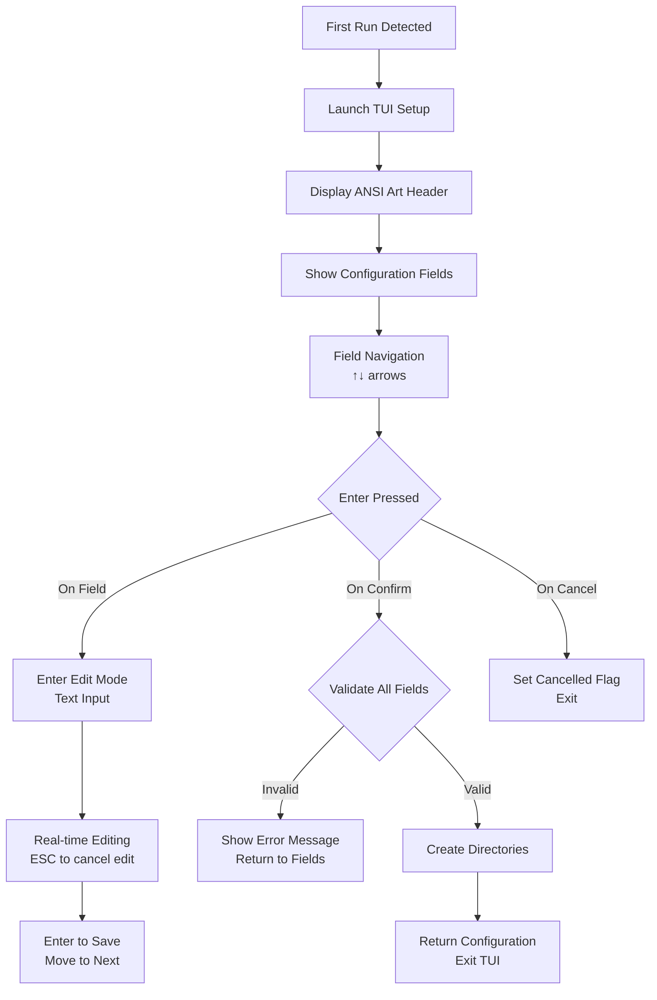

# First-Time Use Guide: Sysop Guided Setup

This document describes the initial server installation and guided setup process for Retrograde BBS sysops.

## Installation & Guided Setup

### Overview

When Retrograde is run for the first time (no database exists), it automatically launches a guided setup process using a Terminal User Interface (TUI) to configure the server. The TUI provides an interactive, visual interface for configuring paths, creating directories, and setting up the initial system configuration.

### Setup Trigger

**Condition:** Database file `data/retrograde.db` does not exist

**Process:** Server detects first run and launches `RunGuidedSetupTUI()`

### Guided Setup Flow

### TUI Interface Description

#### 1. Welcome Screen

**Display:**

- ANSI art header from embedded `guided.ans` file
- Centered instructions: "Use ↑↓ arrows to navigate fields, Enter to select / edit"
- Error messages displayed in red below instructions (if any)

#### 2. Configuration Fields

**Fields Configured:**

- **Root:** Base directory for Retrograde installation (default: current working directory)
- **Data:** Directory for databases and data files (default: `{root}/data`)
- **Files:** Directory for upload/download area storage (default: `{root}/files`)
- **Msgs:** Directory for message base files (default: `{root}/msgs`)
- **Logs:** Directory for log files (default: `{root}/logs`)
- **Security:** Directory for security assets, like blacklists (default: `{root}/security`)
- **Theme:** Directory for art and text-based files (default: `{root}/theme`)

**Field Navigation:**

- **↑/↓ or k/j:** Navigate between fields
- **Enter:** Start editing selected field or confirm/cancel
- **ESC:** Cancel editing current field

**Field Editing:**

- Real-time text input with cursor
- White text on blue background when editing
- Character limit: 200 characters
- All fields are editable (no read-only fields)

**Help Text System:**

- Dynamic help text displayed at bottom for selected field
- Context-sensitive descriptions for each configuration path

#### 3. Confirmation Interface

**Navigation:**

- After last field, navigation enters "confirm mode"
- **↑/↓ or k/j:** Navigate between CONFIRM and CANCEL buttons
- **←/→ or h/l:** Switch between buttons
- **Enter:** Execute selected action

**Buttons:**

- **CONFIRM:** Blue background when selected, validates and proceeds
- **CANCEL:** Red background when selected, cancels setup

#### 4. Directory Creation Logic

**Process:**

1. On CONFIRM, validates all fields are non-empty
2. Creates all configured directories with permissions 0755
3. Continues on directory creation errors (non-fatal)
4. Returns configuration data to caller

**Error Handling:**

- Empty path validation with error message: "Path cannot be empty."
- Directory creation failures are logged but don't prevent setup completion

### Error Handling

- **Empty Path Validation:** Error message "Path cannot be empty." displayed in red
- **Directory Creation Failure:** Logged but non-fatal, setup continues
- **TUI Errors:** Setup fails, returns error to caller
- **Cancellation:** User can cancel at any time, returns nil configuration

### Configuration Structure

Returns `ConfigData` struct containing:

- **Root:** Base installation directory
- **Data:** Database and data files directory
- **Files:** File base directory
- **Msgs:** Message base directory
- **Logs:** Log files directory
- **Security:** Security assets directory
- **Theme:** Theme and art files directory

### Color Scheme

**UI Colors:**

- **Primary:** Blue (#4) for selected fields and CONFIRM button
- **Secondary:** Light Blue (#12) for labels
- **Text:** White (#15) for active elements, Light Gray (#7) for inactive
- **Background:** Dark Gray (#8) for unselected fields, Gray (#240) for inactive buttons
- **Error:** Red (#1) for error messages and CANCEL button
- **Help Text:** Light Gray (#7) for field descriptions

