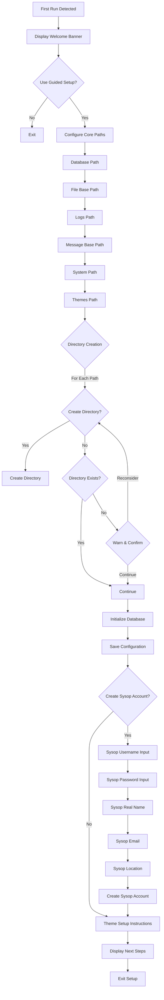
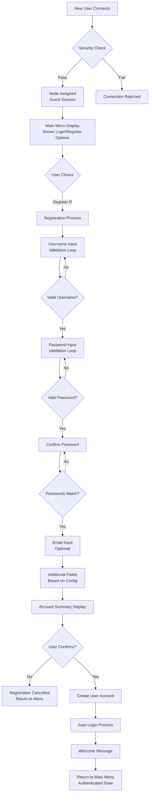

# First-Time Use Guide

This document describes the complete first-time experience for Retrograde BBS, including both the initial server installation/setup and the user registration process.

## Part 1: Installation & Guided Setup

### Overview

When Retrograde is run for the first time (no database exists), it automatically launches a guided setup process to configure the server.

### Setup Trigger

**Condition:** Database file `data/retrograde.db` does not exist

**Process:** Server detects first run and launches `runGuidedSetup()`

### Guided Setup Flow



### Detailed Setup Steps

#### 1. Welcome & Confirmation

**Display:**
```
╔══════════════════════════════════════╗
║    Welcome to Retrograde BBS Setup   ║
╚══════════════════════════════════════╝

Use Guided Setup? (Y/n):
```

**Default:** Y (Yes)

**Action:** If No, exits setup

#### 2. Core Paths Configuration

**Paths Configured:**
- Database: `data/retrograde.db` (fixed)
- File Base: Default `files/`
- Logs: Default `logs/`
- Message Base: Default `msgs/`
- System: Default `system/`
- Themes: Default `themes/`

**For Each Path:**
1. **Prompt:** `Path for {Name} [default: '{default}']:`
2. **Input:** User can enter custom path or press Enter for default
3. **Validation:** Path cannot be empty
4. **Directory Creation:** `Create directory for {Name} at '{path}'? (Y/n):`
   - Y: Creates directory with permissions 0755
   - N: Checks if directory exists
     - If exists: Continue
     - If not: Warning + confirmation to continue without creating

#### 3. Database Initialization

**Actions:**
1. Create `data/` directory if needed
2. Open SQLite database connection
3. Initialize database schema
4. Save default configuration to database

#### 4. Sysop Account Creation (Optional)

**Prompt:** `Create Sysop Account? (Y/n):`

**Default:** Y (Yes)

**If Yes:**
- **Username:** Required, ≥3 characters
- **Password:** Required, ≥6 characters, with confirmation
- **Real Name:** Required
- **Email:** Required, basic validation (@ and . required)
- **Location:** Required

**Account Details:**
- Security Level: 100 (Sysop)
- Auto-creates user in database
- Logs success message

#### 5. Theme Files Setup

**Instructions Displayed:**
```
Theme files setup:
Please copy theme files from the 'theme' directory to '{themes_path}'
Example: cp theme/* {themes_path}/
(This step is optional - you can do it later)
```

#### 6. Completion & Next Steps

**Exit Message:**
```
Retrograde BBS successfully installed... Next steps:
- "retrograde config" to customize, or
- "retrograde" to start server on port 2323
```

**Action:** Exits with code 0

### Error Handling

- **Path Creation Failure:** Displays error, continues
- **Database Errors:** Setup fails, exits with error
- **Sysop Creation Failure:** Setup fails, returns error

### Configuration Defaults

Uses `config.GetDefaultConfig()` with:
- BBS Name: "Retrograde BBS"
- Timeout: 10 minutes
- Max Nodes: 10
- Telnet Port: 2323
- Security: Basic settings enabled

## Part 2: First-Time User Registration

## Complete First-Time User Flow Diagram



## Detailed Registration Steps

### 1. Registration Initiation

**Trigger:** User selects [R]egister from main menu

**Screen Display:**
- Clear screen
- Display GHOSTnet header ANSI art
- Show header bar: "New User Registration [ESC] Quit/Cancel"
- Display instruction: "This will create your account for accessing Retrograde BBS."

### 2. Username Collection & Validation

**Field:** "Username: " (max 20 chars)

**Validation Rules:**
1. **Required:** Cannot be empty
   - Error: "Username cannot be empty."
2. **Minimum Length:** ≥ 3 characters
   - Error: "Username must be at least 3 characters."
3. **Uniqueness:** Must not exist in database
   - Check: `UserExists(username)`
   - Error: "Username {name} already exists."
4. **Character Set:** Letters, numbers, spaces only
   - Regex: `^[a-zA-Z0-9 ]+$`
   - Error: "Username can only contain letters, numbers, and spaces."

**Loop Behavior:** On validation failure, clear field and retry. ESC cancels registration.

### 3. Password Collection & Validation

**Field:** "Password: " (max 20 chars, masked with *)

**Validation Rules:**
1. **Required:** Cannot be empty
   - Error: "Password cannot be empty."
2. **Minimum Length:** ≥ 4 characters
   - Error: "Password must be at least 4 characters."

**Loop Behavior:** On validation failure, clear field and retry. ESC cancels registration.

### 4. Password Confirmation

**Field:** "Confirm Password: " (max 20 chars, masked)

**Validation:** Must match first password entry
- Error: "Passwords do not match."

**Loop Behavior:** On mismatch, clear field and retry. ESC cancels registration.

### 5. Email Collection

**Field:** "Email: " (max 30 chars, optional)

**Validation:** None currently (can be empty)

### 6. Additional Registration Fields

**Configuration:** Based on `RegistrationFields` in config

**Supported Fields:**
- realname (max 50)
- location (max 50)
- phone (max 20)
- website (max 100)
- Custom fields (max 50)

**Behavior:**
- Required fields: Keep prompting until value provided
- Optional fields: Single prompt, can be left empty
- ESC cancels entire registration

### 7. Account Summary & Confirmation

**Display:**
```
Account Summary:
Username: {username}
Password: {****}
Email: {email}
{field}: {value}
...
```

**Confirmation Prompt:** "Create an account with this info? Y/N: "

**Options:**
- Y: Proceed with creation
- N: Cancel registration, return to menu
- ESC: Cancel registration

### 8. Account Creation

**Process:**
1. Hash password with SHA-256 + salt
2. Create user record with default security level (10)
3. Store in SQLite database
4. Log registration success event

**Error Handling:** On creation failure, log error and return to menu

### 9. Automatic Login

**Process:**
1. Log login event for new user
2. Update session with user data
3. Update node manager display
4. Display welcome message: "Account created successfully. Welcome, {username}!"

### 10. Post-Registration State

**Session State:**
- Alias: username (not "Guest")
- SecurityLevel: 10 (regular user)
- Authenticated: true

**Available Options:** All authenticated menu options

## Error Handling & Edge Cases

### Registration Cancellation

**Triggers:** ESC pressed at any input prompt

**Process:**
1. Log "REGISTER_FAILED: registration cancelled by user"
2. Return to main menu
3. No account created

### Validation Failures

**Behavior:**
- Display error message for 2 seconds
- Clear input field
- Retry same input
- Log specific failure reason

### Account Creation Failures

**Possible Causes:**
- Database connection issues
- Duplicate username race condition
- File system permissions

**Handling:**
- Log detailed error
- Display generic failure message
- Return to menu without account

## Security Considerations

### Input Validation

- Username: Restricted character set prevents path traversal
- Password: Minimum length requirement
- Email: No format validation (future enhancement)

### Rate Limiting

- Subject to same connection-level rate limiting as all users
- No separate registration rate limits

### Logging

- All validation failures logged with reason
- Successful registration logged
- Failed attempts tracked (but no blocking for registration specifically)

## Configuration Dependencies

### Required Settings

- Database connection configured
- User storage system initialized

### Optional Enhancements

- `RegistrationFields` configuration for additional prompts
- Email validation (future)
- CAPTCHA integration (future)

## Performance Notes

- Username uniqueness check: Database query per attempt
- Password hashing: SHA-256 (fast, but should migrate to bcrypt)
- File operations: Minimal I/O during registration

## Future Enhancements

- Email verification for account activation
- Password strength requirements
- Registration CAPTCHA
- Welcome email sending
- Account activation workflow
