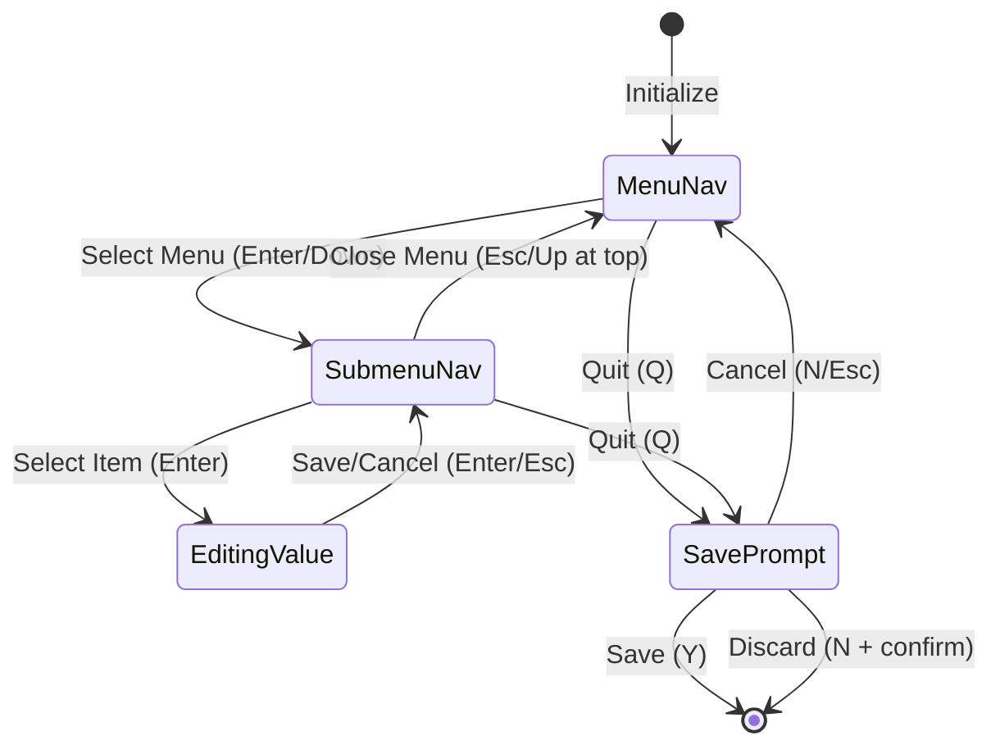

# TUI Architecture Design Document
## GHOSTnet Configuration Editor - Mystic BBS Style Interface

**Version**: 1.0  
**Date**: 2025-10-04  
**Author**: Architecture Mode  
**Status**: Design Phase

---

## Table of Contents

1. [Executive Summary](#executive-summary)
2. [Design Goals](#design-goals)
3. [Data Structure Design](#data-structure-design)
4. [Component Architecture](#component-architecture)
5. [State Machine Design](#state-machine-design)
6. [Rendering Architecture](#rendering-architecture)
7. [Migration Strategy](#migration-strategy)
8. [Implementation Phases](#implementation-phases)
9. [Risk Analysis](#risk-analysis)

---

## Executive Summary

This document outlines the architectural design for transforming the current single-level tabbed TUI configuration editor into a three-tier hierarchical interface matching the Mystic BBS configuration pattern. The new system will feature:

1. **Horizontal Menu Bar** - Top-level category navigation
2. **Vertical Submenu Overlay** - Dropdown menu showing items within selected category
3. **Modal Editor** - Focused value editing with type-specific input handling
4. **Breadcrumb Navigation** - Context display showing current location

The design maintains backward compatibility with existing configuration data while providing a more intuitive, professional BBS-style interface.

---

## Design Goals

### Primary Objectives

1. **Authentic BBS Experience**: Match Mystic BBS navigation patterns for familiarity
2. **Clear Hierarchy**: Three distinct interaction levels prevent information overload
3. **Clean Presentation**: Menu items shown without values for security and clarity
4. **Type-Safe Editing**: Specialized input handling per data type
5. **Maintainability**: Well-structured code following BubbleTea patterns
6. **Extensibility**: Easy addition of new configuration sections

### Non-Functional Requirements

- **Performance**: Instant navigation between states
- **Usability**: Intuitive keyboard controls
- **Accessibility**: Clear visual hierarchy and feedback
- **Reliability**: No data loss during editing
- **Testability**: Isolated components for unit testing

---

## Data Structure Design

### Core Model Structure

```go
// NavigationMode represents the current UI state
type NavigationMode int

const (
    MenuNavigation NavigationMode = iota  // Navigating horizontal menu bar
    SubmenuNavigation                      // Navigating vertical submenu overlay
    EditingValue                           // Editing a value in modal form
    SavePrompt                             // Confirming save on exit
)

// Model represents the complete application state
type Model struct {
    // Configuration data
    config *Config
    
    // Navigation state
    navMode         NavigationMode
    activeMenu      int              // Current horizontal menu index
    activeSubmenu   int              // Current submenu item index
    
    // Menu structure
    menuBar         MenuBar
    
    // Editing state
    editing         bool
    editingItem     *MenuItem
    textInput       textinput.Model
    
    // UI state
    screenWidth     int
    screenHeight    int
    message         string
    savePrompt      bool
    quitting        bool
}

// MenuBar represents the horizontal top-level navigation
type MenuBar struct {
    Items []MenuCategory
}

// MenuCategory represents a top-level menu item with submenu
type MenuCategory struct {
    ID          string              // Unique identifier (e.g., "configuration")
    Label       string              // Display name (e.g., "Configuration")
    Icon        string              // Optional emoji/icon
    HotKey      rune                // Keyboard shortcut (e.g., 'C')
    SubItems    []SubmenuItem       // Items in the submenu
}

// SubmenuItem represents an item in the vertical dropdown menu
type SubmenuItem struct {
    ID          string              // Unique identifier
    Label       string              // Display label
    ItemType    SubmenuItemType     // Type of item
    EditableItem *MenuItem          // If editable, links to MenuItem
    SubItems    []SubmenuItem       // If section header, nested items
}

// SubmenuItemType defines the type of submenu item
type SubmenuItemType int

const (
    SectionHeader SubmenuItemType = iota  // Non-editable section divider
    EditableField                          // Editable configuration value
    ActionItem                             // Triggers an action (e.g., "View Logs")
)

// MenuItem represents an editable configuration value
type MenuItem struct {
    ID          string                    // Unique identifier
    Label       string                    // Display label
    Field       ConfigField               // Link to configuration field
    ValueType   ValueType                 // Data type
    Validation  ValidationFunc            // Validation function
    HelpText    string                    // Help text for editing
}

// ConfigField provides access to configuration values
type ConfigField struct {
    GetValue    func() interface{}        // Getter function
    SetValue    func(interface{}) error   // Setter function with validation
}

// ValueType defines supported data types
type ValueType int

const (
    StringValue ValueType = iota
    IntValue
    BoolValue
    ListValue      // Comma-separated list
    PortValue      // Integer with port range validation
    PathValue      // File/directory path
)

// ValidationFunc validates input based on value type
type ValidationFunc func(interface{}) error
```

### Menu Structure Definition

```go
// buildMenuStructure constructs the complete menu hierarchy
func buildMenuStructure(config *Config) MenuBar {
    return MenuBar{
        Items: []MenuCategory{
            {
                ID:     "configuration",
                Label:  "Configuration",
                Icon:   "🏗️",
                HotKey: 'C',
                SubItems: []SubmenuItem{
                    {
                        ID:       "system-paths",
                        Label:    "System Paths",
                        ItemType: SectionHeader,
                        SubItems: []SubmenuItem{
                            {
                                ID:       "data-dir",
                                Label:    "Data Directory",
                                ItemType: EditableField,
                                EditableItem: &MenuItem{
                                    ID:        "config.data_dir",
                                    Label:     "Data Directory",
                                    ValueType: PathValue,
                                    Field: ConfigField{
                                        GetValue: func() interface{} { return config.DataDirectory },
                                        SetValue: func(v interface{}) error {
                                            config.DataDirectory = v.(string)
                                            return nil
                                        },
                                    },
                                    HelpText: "Directory for application data storage",
                                },
                            },
                            // ... more path fields
                        },
                    },
                    {
                        ID:       "general-settings",
                        Label:    "General Settings",
                        ItemType: SectionHeader,
                        SubItems: []SubmenuItem{
                            {
                                ID:       "bbs-name",
                                Label:    "BBS Name",
                                ItemType: EditableField,
                                EditableItem: &MenuItem{
                                    ID:        "config.bbs_name",
                                    Label:     "BBS Name",
                                    ValueType: StringValue,
                                    Field: ConfigField{
                                        GetValue: func() interface{} { return config.BBSName },
                                        SetValue: func(v interface{}) error {
                                            config.BBSName = v.(string)
                                            return nil
                                        },
                                    },
                                    HelpText: "Name of your BBS system",
                                },
                            },
                            // ... more general settings
                        },
                    },
                },
            },
            {
                ID:     "networking",
                Label:  "Networking",
                Icon:   "🌐",
                HotKey: 'N',
                SubItems: []SubmenuItem{
                    // Networking submenu items
                },
            },
            {
                ID:     "servers",
                Label:  "Servers",
                Icon:   "🖥️",
                HotKey: 'S',
                SubItems: []SubmenuItem{
                    // Server submenu items
                },
            },
            {
                ID:     "editors",
                Label:  "Editors",
                Icon:   "✏️",
                HotKey: 'E',
                SubItems: []SubmenuItem{
                    // Editor submenu items
                },
            },
            {
                ID:     "other",
                Label:  "Other",
                Icon:   "🔧",
                HotKey: 'O',
                SubItems: []SubmenuItem{
                    // Other submenu items
                },
            },
        },
    }
}
```

### State Management Helpers

```go
// Navigation helpers
func (m *Model) getCurrentCategory() *MenuCategory {
    if m.activeMenu >= 0 && m.activeMenu < len(m.menuBar.Items) {
        return &m.menuBar.Items[m.activeMenu]
    }
    return nil
}

func (m *Model) getCurrentSubmenuItem() *SubmenuItem {
    category := m.getCurrentCategory()
    if category == nil {
        return nil
    }
    
    // Flatten submenu items to get the active one
    items := m.flattenSubmenuItems(category.SubItems)
    if m.activeSubmenu >= 0 && m.activeSubmenu < len(items) {
        return &items[m.activeSubmenu]
    }
    return nil
}

func (m *Model) flattenSubmenuItems(items []SubmenuItem) []SubmenuItem {
    var result []SubmenuItem
    for _, item := range items {
        result = append(result, item)
        if len(item.SubItems) > 0 {
            result = append(result, m.flattenSubmenuItems(item.SubItems)...)
        }
    }
    return result
}

// State transition helpers
func (m *Model) enterSubmenuMode() {
    m.navMode = SubmenuNavigation
    m.activeSubmenu = 0
}

func (m *Model) exitSubmenuMode() {
    m.navMode = MenuNavigation
    m.activeSubmenu = 0
}

func (m *Model) startEditing(item *MenuItem) {
    m.navMode = EditingValue
    m.editing = true
    m.editingItem = item
    
    // Initialize text input with current value
    currentValue := item.Field.GetValue()
    m.textInput.SetValue(formatValue(currentValue, item.ValueType))
    m.textInput.Focus()
}

func (m *Model) cancelEditing() {
    m.navMode = SubmenuNavigation
    m.editing = false
    m.editingItem = nil
    m.textInput.Blur()
}

func (m *Model) saveEditing() error {
    if m.editingItem == nil {
        return fmt.Errorf("no item being edited")
    }
    
    // Parse and validate input
    value, err := parseValue(m.textInput.Value(), m.editingItem.ValueType)
    if err != nil {
        return err
    }
    
    // Validate if validation function exists
    if m.editingItem.Validation != nil {
        if err := m.editingItem.Validation(value); err != nil {
            return err
        }
    }
    
    // Save value
    if err := m.editingItem.Field.SetValue(value); err != nil {
        return err
    }
    
    m.cancelEditing()
    return nil
}
```

---

## Component Architecture

### Component Overview

The UI is composed of four main components, each responsible for a specific aspect of the interface:

```
┌─────────────────────────────────────────────────────┐
│ MenuBar Component (Always visible)                  │
├─────────────────────────────────────────────────────┤
│                                                     │
│         Background/Content Area                     │
│                                                     │
│    ┌──────────────────────┐                        │
│    │ SubmenuOverlay       │                        │
│    │ (Conditional)        │                        │
│    │                      │                        │
│    │  ┌──────────────┐    │                        │
│    │  │ ModalEditor  │    │                        │
│    │  │ (Conditional)│    │                        │
│    │  └──────────────┘    │                        │
│    └──────────────────────┘                        │
│                                                     │
├─────────────────────────────────────────────────────┤
│ Breadcrumb Component (Always visible)              │
└─────────────────────────────────────────────────────┘
```

### 1. MenuBar Component

**Responsibility**: Horizontal top-level navigation

```go
type MenuBarComponent struct {
    items       []MenuCategory
    activeIndex int
    width       int
}

func (c *MenuBarComponent) Render() string {
    var items []string
    
    for i, item := range c.items {
        style := c.getMenuItemStyle(i == c.activeIndex)
        label := fmt.Sprintf(" %s %s ", item.Icon, item.Label)
        items = append(items, style.Render(label))
    }
    
    // Join with single space and center in available width
    return lipgloss.NewStyle().
        Width(c.width).
        Align(lipgloss.Center).
        Render(strings.Join(items, " "))
}

func (c *MenuBarComponent) getMenuItemStyle(active bool) lipgloss.Style {
    if active {
        return lipgloss.NewStyle().
            Bold(true).
            Foreground(lipgloss.Color("15")).  // White text
            Background(lipgloss.Color("33"))   // Blue background
    }
    return lipgloss.NewStyle().
        Foreground(lipgloss.Color("250")).     // Gray text
        Background(lipgloss.Color("235"))      // Dark gray background
}

func (c *MenuBarComponent) HandleKey(key string) (handled bool) {
    switch key {
    case "left", "h":
        c.activeIndex = (c.activeIndex - 1 + len(c.items)) % len(c.items)
        return true
    case "right", "l":
        c.activeIndex = (c.activeIndex + 1) % len(c.items)
        return true
    }
    return false
}
```

### 2. SubmenuOverlay Component

**Responsibility**: Vertical dropdown menu for category items

```go
type SubmenuOverlayComponent struct {
    items           []SubmenuItem
    activeIndex     int
    x, y            int  // Position on screen
    width, height   int  // Dimensions
    scrollOffset    int  // For scrolling long lists
}

func (c *SubmenuOverlayComponent) Render() string {
    var lines []string
    
    // Calculate visible range based on scroll offset
    visibleItems := c.getVisibleItems()
    
    for i, item := range visibleItems {
        line := c.renderSubmenuItem(item, i == c.activeIndex-c.scrollOffset)
        lines = append(lines, line)
    }
    
    content := strings.Join(lines, "\n")
    
    // Apply overlay style with border
    return lipgloss.NewStyle().
        Width(c.width).
        Height(c.height).
        Border(lipgloss.RoundedBorder()).
        BorderForeground(lipgloss.Color("39")).
        Background(lipgloss.Color("234")).
        Padding(0, 1).
        Render(content)
}

func (c *SubmenuOverlayComponent) renderSubmenuItem(item SubmenuItem, active bool) string {
    var prefix string
    var style lipgloss.Style
    
    switch item.ItemType {
    case SectionHeader:
        prefix = "─"
        style = lipgloss.NewStyle().
            Bold(true).
            Foreground(lipgloss.Color("33"))
    case EditableField:
        prefix = " "
        if active {
            style = lipgloss.NewStyle().
                Bold(true).
                Foreground(lipgloss.Color("11")).  // Bright yellow
                Background(lipgloss.Color("235"))
        } else {
            style = lipgloss.NewStyle().
                Foreground(lipgloss.Color("250"))
        }
    case ActionItem:
        prefix = ">"
        style = lipgloss.NewStyle().
            Foreground(lipgloss.Color("39"))
    }
    
    return style.Render(fmt.Sprintf("%s %s", prefix, item.Label))
}

func (c *SubmenuOverlayComponent) getVisibleItems() []SubmenuItem {
    maxVisible := c.height - 2  // Account for border/padding
    start := c.scrollOffset
    end := min(start+maxVisible, len(c.items))
    return c.items[start:end]
}

func (c *SubmenuOverlayComponent) HandleKey(key string) (handled bool) {
    switch key {
    case "up", "k":
        if c.activeIndex > 0 {
            c.activeIndex--
            c.adjustScrollOffset()
        }
        return true
    case "down", "j":
        if c.activeIndex < len(c.items)-1 {
            c.activeIndex++
            c.adjustScrollOffset()
        }
        return true
    case "pageup":
        c.activeIndex = max(0, c.activeIndex-10)
        c.adjustScrollOffset()
        return true
    case "pagedown":
        c.activeIndex = min(len(c.items)-1, c.activeIndex+10)
        c.adjustScrollOffset()
        return true
    }
    return false
}

func (c *SubmenuOverlayComponent) adjustScrollOffset() {
    maxVisible := c.height - 2
    if c.activeIndex < c.scrollOffset {
        c.scrollOffset = c.activeIndex
    } else if c.activeIndex >= c.scrollOffset+maxVisible {
        c.scrollOffset = c.activeIndex - maxVisible + 1
    }
}

// Calculate position to center on screen
func (c *SubmenuOverlayComponent) CalculatePosition(screenWidth, screenHeight int) {
    c.width = min(40, screenWidth-4)   // Max 40 chars wide
    c.height = min(20, screenHeight-6)  // Leave room for menu bar and breadcrumb
    c.x = 2  // Slight offset from left edge
    c.y = 3  // Below menu bar
}
```

### 3. ModalEditor Component

**Responsibility**: Focused value editing form

```go
type ModalEditorComponent struct {
    item        *MenuItem
    textInput   textinput.Model
    errorMsg    string
    width       int
    height      int
}

func (c *ModalEditorComponent) Render() string {
    var content strings.Builder
    
    // Title
    title := lipgloss.NewStyle().
        Bold(true).
        Foreground(lipgloss.Color("39")).
        Render(fmt.Sprintf("Editing: %s", c.item.Label))
    content.WriteString(title + "\n\n")
    
    // Help text
    if c.item.HelpText != "" {
        help := lipgloss.NewStyle().
            Foreground(lipgloss.Color("243")).
            Render(c.item.HelpText)
        content.WriteString(help + "\n\n")
    }
    
    // Input field
    content.WriteString(c.textInput.View() + "\n\n")
    
    // Error message if any
    if c.errorMsg != "" {
        error := lipgloss.NewStyle().
            Foreground(lipgloss.Color("196")).
            Render("Error: " + c.errorMsg)
        content.WriteString(error + "\n\n")
    }
    
    // Instructions
    instructions := lipgloss.NewStyle().
        Foreground(lipgloss.Color("241")).
        Render("Enter to save • Esc to cancel")
    content.WriteString(instructions)
    
    // Apply modal style
    return lipgloss.NewStyle().
        Width(c.width).
        Border(lipgloss.RoundedBorder()).
        BorderForeground(lipgloss.Color("39")).
        Background(lipgloss.Color("234")).
        Padding(1, 2).
        Render(content.String())
}

func (c *ModalEditorComponent) HandleInput(msg tea.Msg) tea.Cmd {
    switch msg := msg.(type) {
    case tea.KeyMsg:
        switch msg.String() {
        case "enter":
            // Validation happens in parent model
            return nil
        case "esc":
            return nil
        default:
            var cmd tea.Cmd
            c.textInput, cmd = c.textInput.Update(msg)
            c.errorMsg = ""  // Clear error on new input
            return cmd
        }
    }
    return nil
}

// Calculate centered position
func (c *ModalEditorComponent) CalculatePosition(screenWidth, screenHeight int) {
    c.width = min(60, screenWidth-10)
    c.height = 12
}
```

### 4. Breadcrumb Component

**Responsibility**: Display current navigation context

```go
type BreadcrumbComponent struct {
    category    string
    submenu     string
    item        string
    width       int
}

func (c *BreadcrumbComponent) Render() string {
    var parts []string
    
    if c.category != "" {
        parts = append(parts, c.category)
    }
    if c.submenu != "" {
        parts = append(parts, c.submenu)
    }
    if c.item != "" {
        parts = append(parts, c.item)
    }
    
    breadcrumb := strings.Join(parts, " → ")
    
    return lipgloss.NewStyle().
        Width(c.width).
        Foreground(lipgloss.Color("241")).
        Background(lipgloss.Color("235")).
        Padding(0, 1).
        Render("Navigation: " + breadcrumb)
}

func (c *BreadcrumbComponent) Update(category, submenu, item string) {
    c.category = category
    c.submenu = submenu
    c.item = item
}
```

### Component Integration

```go
// Component manager coordinates all components
type ComponentManager struct {
    menuBar      MenuBarComponent
    submenu      *SubmenuOverlayComponent
    editor       *ModalEditorComponent
    breadcrumb   BreadcrumbComponent
    screenWidth  int
    screenHeight int
}

func (cm *ComponentManager) Update(model *Model) {
    // Update menu bar
    cm.menuBar.activeIndex = model.activeMenu
    cm.menuBar.width = cm.screenWidth
    
    // Update submenu if visible
    if model.navMode >= SubmenuNavigation {
        category := model.getCurrentCategory()
        if category != nil && cm.submenu == nil {
            cm.submenu = &SubmenuOverlayComponent{
                items: category.SubItems,
            }
            cm.submenu.CalculatePosition(cm.screenWidth, cm.screenHeight)
        }
        if cm.submenu != nil {
            cm.submenu.activeIndex = model.activeSubmenu
        }
    } else {
        cm.submenu = nil
    }
    
    // Update editor if visible
    if model.navMode == EditingValue && model.editingItem != nil {
        if cm.editor == nil {
            cm.editor = &ModalEditorComponent{
                item:      model.editingItem,
                textInput: model.textInput,
            }
            cm.editor.CalculatePosition(cm.screenWidth, cm.screenHeight)
        }
    } else {
        cm.editor = nil
    }
    
    // Update breadcrumb
    cm.updateBreadcrumb(model)
}

func (cm *ComponentManager) updateBreadcrumb(model *Model) {
    var category, submenu, item string
    
    if cat := model.getCurrentCategory(); cat != nil {
        category = cat.Label
    }
    
    if sub := model.getCurrentSubmenuItem(); sub != nil {
        submenu = sub.Label
    }
    
    if model.editing && model.editingItem != nil {
        item = model.editingItem.Label
    }
    
    cm.breadcrumb.Update(category, submenu, item)
    cm.breadcrumb.width = cm.screenWidth
}
```

---

## State Machine Design

### Navigation State Diagram



### State Transition Rules

```go
// State transition matrix
type StateTransition struct {
    From      NavigationMode
    To        NavigationMode
    Condition func(*Model) bool
    Action    func(*Model)
}

var stateTransitions = []StateTransition{
    // MenuNavigation transitions
    {
        From: MenuNavigation,
        To:   SubmenuNavigation,
        Condition: func(m *Model) bool {
            // User pressed down or enter
            return true
        },
        Action: func(m *Model) {
            m.enterSubmenuMode()
        },
    },
    {
        From: MenuNavigation,
        To:   SavePrompt,
        Condition: func(m *Model) bool {
            // User pressed 'q'
            return true
        },
        Action: func(m *Model) {
            m.savePrompt = true
        },
    },
    
    // SubmenuNavigation transitions
    {
        From: SubmenuNavigation,
        To:   MenuNavigation,
        Condition: func(m *Model) bool {
            // User pressed esc or up at top of list
            return m.activeSubmenu == 0
        },
        Action: func(m *Model) {
            m.exitSubmenuMode()
        },
    },
    {
        From: SubmenuNavigation,
        To:   EditingValue,
        Condition: func(m *Model) bool {
            // Selected item is editable
            item := m.getCurrentSubmenuItem()
            return item != nil && item.ItemType == EditableField
        },
        Action: func(m *Model) {
            item := m.getCurrentSubmenuItem()
            if item.EditableItem != nil {
                m.startEditing(item.EditableItem)
            }
        },
    },
    
    // EditingValue transitions
    {
        From: EditingValue,
        To:   SubmenuNavigation,
        Condition: func(m *Model) bool {
            // User pressed esc or enter (after validation)
            return true
        },
        Action: func(m *Model) {
            m.cancelEditing()
        },
    },
}
```

### Input Handling Per State

```go
func (m Model) Update(msg tea.Msg) (tea.Model, tea.Cmd) {
    switch msg := msg.(type) {
    case tea.WindowSizeMsg:
        m.screenWidth = msg.Width
        m.screenHeight = msg.Height
        return m, nil
        
    case tea.KeyMsg:
        // Global quit handling
        if msg.String() == "ctrl+c" {
            return m, tea.Quit
        }
        
        // State-specific handling
        switch m.navMode {
        case MenuNavigation:
            return m.handleMenuNavigation(msg)
        case SubmenuNavigation:
            return m.handleSubmenuNavigation(msg)
        case EditingValue:
            return m.handleEditing(msg)
        case SavePrompt:
            return m.handleSavePrompt(msg)
        }
    }
    
    return m, nil
}

func (m Model) handleMenuNavigation(msg tea.KeyMsg) (tea.Model, tea.Cmd) {
    switch msg.String() {
    case "left", "h":
        m.activeMenu = (m.activeMenu - 1 + len(m.menuBar.Items)) % len(m.menuBar.Items)
    case "right", "l":
        m.activeMenu = (m.activeMenu + 1) % len(m.menuBar.Items)
    case "down", "j", "enter":
        m.enterSubmenuMode()
    case "q":
        m.savePrompt = true
    case "1", "2", "3", "4", "5":
        // Direct menu access
        idx := int(msg.String()[0] - '1')
        if idx >= 0 && idx < len(m.menuBar.Items) {
            m.activeMenu = idx
        }
    }
    return m, nil
}

func (m Model) handleSubmenuNavigation(msg tea.KeyMsg) (tea.Model, tea.Cmd) {
    switch msg.String() {
    case "up", "k":
        if m.activeSubmenu > 0 {
            m.activeSubmenu--
        } else {
            // At top, go back to menu bar
            m.exitSubmenuMode()
        }
    case "down", "j":
        category := m.getCurrentCategory()
        if category != nil {
            maxItems := len(m.flattenSubmenuItems(category.SubItems))
            if m.activeSubmenu < maxItems-1 {
                m.activeSubmenu++
            }
        }
    case "left", "h":
        // Navigate to previous menu
        m.activeMenu = (m.activeMenu - 1 + len(m.menuBar.Items)) % len(m.menuBar.Items)
        m.activeSubmenu = 0
    case "right", "l":
        // Navigate to next menu
        m.activeMenu = (m.activeMenu + 1) % len(m.menuBar.Items)
        m.activeSubmenu = 0
    case "enter":
        // Try to edit selected item
        item := m.getCurrentSubmenuItem()
        if item != nil && item.ItemType == EditableField && item.EditableItem != nil {
            m.startEditing(item.EditableItem)
        }
    case "esc":
        m.exitSubmenuMode()
    case "q":
        m.savePrompt = true
    }
    return m, nil
}

func (m Model) handleEditing(msg tea.KeyMsg) (tea.Model, tea.Cmd) {
    switch msg.String() {
    case "enter":
        // Attempt to save
        if err := m.saveEditing(); err != nil {
            m.message = fmt.Sprintf("Error: %v", err)
            return m, nil
        }
        return m, nil
    case "esc":
        m.cancelEditing()
        return m, nil
    default:
        // Pass to text input
        var cmd tea.Cmd
        m.textInput, cmd = m.textInput.Update(msg)
        return m, cmd
    }
}

func (m Model) handleSavePrompt(msg tea.KeyMsg) (tea.Model, tea.Cmd) {
    switch msg.String() {
    case "y", "Y":
        // Save and quit
        if err := SaveConfig(m.config, "config.ini"); err != nil {
            m.message = fmt.Sprintf("Error saving: %v", err)
            m.savePrompt = false
            return m, nil
        }
        return m, tea.Quit
    case "n", "N":
        // Quit without saving
        return m, tea.Quit
    case "esc":
        // Cancel quit
        m.savePrompt = false
        return m, nil
    }
    return m, nil
}
```

### Error States and Recovery

```go
// Error handling strategies
type ErrorState int

const (
    NoError ErrorState = iota
    ValidationError    // User input failed validation
    SaveError         // Configuration save failed
    LoadError         // Configuration load failed
)

func (m *Model) handleError(err error, context string) {
    m.message = fmt.Sprintf("%s: %v", context, err)
    
    // Log error
    logError(err, context)
    
    // Set appropriate error state
    switch {
    case strings.Contains(err.Error(), "validation"):
        // Stay in editing mode, show error
        return
    case strings.Contains(err.Error(), "save"):
        // Return to navigation, show error
        m.cancelEditing()
    default:
        // Generic error, show message
        m.cancelEditing()
    }
}

// Edge case handling
func (m *Model) validateState() bool {
    // Ensure indices are in bounds
    if m.activeMenu < 0 || m.activeMenu >= len(m.menuBar.Items) {
        m.activeMenu = 0
    }
    
    category := m.getCurrentCategory()
    if category != nil {
        items := m.flattenSubmenuItems(category.SubItems)
        if m.activeSubmenu < 0 || m.activeSubmenu >= len(items) {
            m.activeSubmenu = 0
        }
    }
    
    return true
}
```

---

## Rendering Architecture

### Layer Composition

The rendering system uses a layered approach where components are drawn in order:

```go
// Render order (back to front):
// 1. Background layer (ANSI art)
// 2. Menu bar (always visible)
// 3. Content area (depends on mode)
// 4. Submenu overlay (conditional)
// 5. Modal editor (conditional)
// 6. Breadcrumb (always visible)
// 7. Message/status (conditional)

func (m Model) View() string {
    // Create layers
    layers := []string{}
    
    // Layer 1: Background
    background := m.renderBackground()
    layers = append(layers, background)
    
    // Layer 2: Menu bar
    menuBar := m.componentManager.menuBar.Render()
    layers = append(layers, menuBar)
    
    // Layer 3: Content area
    if m.navMode == MenuNavigation {
        // Show welcome or last selected info
        content := m.renderWelcomeContent()
        layers = append(layers, content)
    }
    
    // Layer 4: Submenu overlay
    if m.navMode >= SubmenuNavigation && m.componentManager.submenu != nil {
        submenu := m.componentManager.submenu.Render()
        layers = append(layers, m.positionOverlay(submenu, 
            m.componentManager.submenu.x, 
            m.componentManager.submenu.y))
    }
    
    // Layer 5: Modal editor
    if m.navMode == EditingValue && m.componentManager.editor != nil {
        editor := m.componentManager.editor.Render()
        // Center modal
        x := (m.screenWidth - m.componentManager.editor.width) / 2
        y := (m.screenHeight - m.componentManager.editor.height) / 2
        layers = append(layers, m.positionOverlay(editor, x, y))
    }
    
    // Layer 6: Breadcrumb
    breadcrumb := m.componentManager.breadcrumb.Render()
    layers = append(layers, breadcrumb)
    
    // Layer 7: Messages
    if m.message != "" {
        msg := m.renderMessage()
        layers = append(layers, msg)
    }
    
    // Compose layers
    return m.composeLayers(layers)
}
```

### Overlay Positioning

```go
// positionOverlay places content at specific screen coordinates
func (m Model) positionOverlay(content string, x, y int) string {
    lines := strings.Split(content, "\n")
    var positioned []string
    
    for i, line := range lines {
        row := y + i
        if row >= 0 && row < m.screenHeight {
            // Add positioning escape codes
            positioned = append(positioned, 
                fmt.Sprintf("\x1b[%d;%dH%s", row+1, x+1, line))
        }
    }
    
    return strings.Join(positioned, "")
}

// composeLayers merges layers using absolute positioning
func (m Model) composeLayers(layers []string) string {
    var doc strings.Builder
    
    // Start with clear screen
    doc.WriteString("\x1b[2J\x1b[H")
    
    for _, layer := range layers {
        doc.WriteString(layer)
    }
    
    return doc.String()
}
```

### Lipgloss Styling System

```go
// Centralized style definitions
var (
    // Color palette
    colorPrimary      = lipgloss.Color("39")   // Blue
    colorSecondary    = lipgloss.Color("33")   // Lighter blue
    colorAccent       = lipgloss.Color("11")   // Bright yellow
    colorBackground   = lipgloss.Color("234")  // Dark gray
    colorBorder       = lipgloss.Color("240")  // Medium gray
    colorText         = lipgloss.Color("250")  // Light gray
    colorTextBright   = lipgloss.Color("15")   // White
    colorError        = lipgloss.Color("196")  // Red
    colorSuccess      = lipgloss.Color("46")   // Green
    colorMuted        = lipgloss.Color("241")  // Dim gray
    
    // Reusable styles
    styleMenuActive = lipgloss.NewStyle().
        Bold(true).
        Foreground(colorTextBright).
        Background(colorPrimary).
        Padding(0, 1)
    
    styleMenuInactive = lipgloss.NewStyle().
        Foreground(colorText).
        Background(colorBackground).
        Padding(0, 1)
    
    styleSubmenuActive = lipgloss.NewStyle().
        Bold(true).
        Foreground(colorAccent).
        Background(colorBorder)
    
    styleSubmenuInactive = lipgloss.NewStyle().
        Foreground(colorText)
    
    styleModalBorder = lipgloss.NewStyle().
        Border(lipgloss.RoundedBorder()).
        BorderForeground(colorPrimary).
        Background(colorBackground).
        Padding(1, 2)
    
    styleOverlayBorder = lipgloss.NewStyle().
        Border(lipgloss.RoundedBorder()).
        BorderForeground(colorSecondary).
        Background(colorBackground).
        Padding(0, 1)
    
    styleBreadcrumb = lipgloss.NewStyle().
        Foreground(colorMuted).
        Background(colorBackground).
        Padding(0, 1)
    
    styleError = lipgloss.NewStyle().
        Foreground(colorError).
        Bold(true)
    
    styleSuccess = lipgloss.NewStyle().
        Foreground(colorSuccess).
        Bold(true)
)

// Style application helpers
func applyMenuStyle(text string, active bool) string {
    if active {
        return styleMenuActive.Render(text)
    }
    return styleMenuInactive.Render(text)
}

func applySubmenuStyle(text string, active bool) string {
    if active {
        return styleSubmenuActive.Render(text)
    }
    return styleSubmenuInactive.Render(text)
}
```

### Viewport and Scrolling

```go
// Viewport manages scrollable content
type Viewport struct {
    content       []string
    width         int
    height        int
    scrollOffset  int
    maxScroll     int
}

func (v *Viewport) Update(content []string) {
    v.content = content
    v.maxScroll = max(0, len(content)-v.height)
}

func (v *Viewport) ScrollUp(lines int) {
    v.scrollOffset = max(0, v.scrollOffset-lines)
}

func (v *Viewport) ScrollDown(lines int) {
    v.scrollOffset = min(v.maxScroll, v.scrollOffset+lines)
}

func (v *Viewport) Render() string {
    if len(v.content) == 0 {
        return ""
    }
    
    start := v.scrollOffset
    end := min(len(v.content), start+v.height)
    visible := v.content[start:end]
    
    // Add scroll indicators
    if v.scrollOffset > 0 {
        visible[0] = "↑ " + visible[0]
    }
    if v.scrollOffset < v.maxScroll {
        visible[len(visible)-1] = "↓ " + visible[len(visible)-1]
    }
    
    return strings.Join(visible, "\n")
}
```

---

## Migration Strategy

### Phase 0: Preparation

**Objective**: Set up infrastructure for safe migration

```go
// 1. Create backup of current implementation
// 2. Add feature flag system

type FeatureFlags struct {
    UseNewTUI bool
}

var flags = FeatureFlags{
    UseNewTUI: false,  // Start disabled
}

// 3. Create new file structure
// config-editor-tui-v2.go - New implementation
// config-editor-tui.go - Keep old for fallback

// 4. Add toggle mechanism
func runConfigEditor(config *Config) {
    if flags.UseNewTUI {
        runConfigEditorTUIv2(config)
    } else {
        runConfigEditorTUI(config)
    }
}
```

### Phase 1: Data Structure Migration

**Objective**: Map existing config to new hierarchical model

```go
// Mapping strategy
type ConfigMigration struct {
    oldModel  model
    newModel  Model
}

func (cm *ConfigMigration) MapConfiguration() error {
    // Map existing flat structure to hierarchical
    cm.newModel.config = cm.oldModel.config
    
    // Build menu structure from existing data
    cm.newModel.menuBar = buildMenuStructure(cm.newModel.config)
    
    return nil
}

// Data preservation strategy
func preserveConfigData() error {
    // 1. Load existing config
    config, err := LoadConfig("config.ini")
    if err != nil {
        return err
    }
    
    // 2. Validate all fields present
    if err := validateConfigComplete(config); err != nil {
        return fmt.Errorf("incomplete config: %w", err)
    }
    
    // 3. Create backup
    if err := backupConfig("config.ini", "config.ini.backup"); err != nil {
        return err
    }
    
    return nil
}
```

### Phase 2: Component Integration

**Objective**: Gradually replace old components with new ones

```go
// Staged rollout
type MigrationStage int

const (
    StageMenuBar MigrationStage = iota
    StageSubmenu
    StageModal
    StageFull
)

var currentStage = StageMenuBar

func renderHybrid(m Model) string {
    switch currentStage {
    case StageMenuBar:
        // Use new menu bar, old content
        return renderWithNewMenuBar(m)
    case StageSubmenu:
        // Use new menu bar + submenu, old editing
        return renderWithNewMenuAndSubmenu(m)
    case StageModal:
        // Use all new components except breadcrumb
        return renderWithNewComponents(m)
    case StageFull:
        // Use fully new implementation
        return m.View()
    default:
        return m.oldView()
    }
}
```

### Phase 3: Testing Strategy

```go
// Test plan per phase
type TestSuite struct {
    name  string
    tests []TestCase
}

var migrationTests = []TestSuite{
    {
        name: "MenuBar Component",
        tests: []TestCase{
            {
                name: "Navigate left",
                test: func(t *testing.T) {
                    m := initialModel(testConfig)
                    m.activeMenu = 1
                    m, _ = m.Update(tea.KeyMsg{Type: tea.KeyLeft})
                    assert.Equal(t, 0, m.activeMenu)
                },
            },
            {
                name: "Navigate right",
                test: func(t *testing.T) {
                    m := initialModel(testConfig)
                    m.activeMenu = 0
                    m, _ = m.Update(tea.KeyMsg{Type: tea.KeyRight})
                    assert.Equal(t, 1, m.activeMenu)
                },
            },
            // ... more tests
        },
    },
    {
        name: "Submenu Component",
        tests: []TestCase{
            {
                name: "Open submenu",
                test: func(t *testing.T) {
                    m := initialModel(testConfig)
                    m, _ = m.Update(tea.KeyMsg{Type: tea.KeyEnter})
                    assert.Equal(t, SubmenuNavigation, m.navMode)
                },
            },
            // ... more tests
        },
    },
    // ... more suites
}

// Integration tests
func TestFullNavigationFlow(t *testing.T) {
    m := initialModel(testConfig)
    
    // Navigate to Servers menu
    m, _ = m.Update(tea.KeyMsg{Type: tea.KeyRight})
    m, _ = m.Update(tea.KeyMsg{Type: tea.KeyRight})
    assert.Equal(t, "Servers", m.menuBar.Items[m.activeMenu].Label)
    
    // Open submenu
    m, _ = m.Update(tea.KeyMsg{Type: tea.KeyEnter})
    assert.Equal(t, SubmenuNavigation, m.navMode)
    
    // Navigate to port setting
    m, _ = m.Update(tea.KeyMsg{Type: tea.KeyDown})
    
    // Open editor
    m, _ = m.Update(tea.KeyMsg{Type: tea.KeyEnter})
    assert.Equal(t, EditingValue, m.navMode)
    
    // Edit value
    m.textInput.SetValue("2424")
    m, _ = m.Update(tea.KeyMsg{Type: tea.KeyEnter})
    
    // Verify save
    assert.Equal(t, 2424, m.config.TelnetPort)
}
```

### Phase 4: Rollback Plan

```go
// Rollback mechanism
type RollbackPoint struct {
    timestamp time.Time
    config    *Config
    backup    string
}

var rollbackPoints []RollbackPoint

func createRollbackPoint() error {
    // Save current state
    rp := RollbackPoint{
        timestamp: time.Now(),
        config:    cloneConfig(globalConfig),
        backup:    fmt.Sprintf("config.rollback.%d.ini", time.Now().Unix()),
    }
    
    if err := SaveConfig(rp.config, rp.backup); err != nil {
        return err
    }
    
    rollbackPoints = append(rollbackPoints, rp)
    return nil
}

func rollback(point RollbackPoint) error {
    // Restore configuration
    config, err := LoadConfig(point.backup)
    if err != nil {
        return err
    }
    
    if err := SaveConfig(config, "config.ini"); err != nil {
        return err
    }
    
    // Switch back to old TUI
    flags.UseNewTUI = false
    
    return nil
}

// Error recovery
func handleMigrationError(err error) {
    log.Printf("Migration error: %v", err)
    
    // Attempt automatic rollback
    if len(rollbackPoints) > 0 {
        latest := rollbackPoints[len(rollbackPoints)-1]
        if rollbackErr := rollback(latest); rollbackErr != nil {
            log.Printf("Rollback failed: %v", rollbackErr)
            // Manual intervention required
        }
    }
}
```

---

## Implementation Phases

### Phase 1: Data Structures (Week 1)

**Goal**: Implement complete data model

**Tasks**:
1. Define all structs (NavigationMode, Model, MenuBar, MenuCategory, etc.)
2. Implement helper functions (getCurrentCategory, flattenSubmenuItems, etc.)
3. Create menu structure builder (buildMenuStructure)
4. Write unit tests for data structures
5. Implement state transition helpers

**Success Criteria**:
- All structs compile without errors
- Menu structure correctly represents config sections
- Helper functions return expected results
- 100% test coverage on data structures

**Deliverables**:
- `tui-model.go` - Core data structures
- `tui-menu-builder.go` - Menu construction
- `tui-model_test.go` - Unit tests

### Phase 2: Component Architecture (Week 2)

**Goal**: Build individual UI components

**Tasks**:
1. Implement MenuBarComponent
2. Implement SubmenuOverlayComponent
3. Implement ModalEditorComponent
4. Implement BreadcrumbComponent
5. Create ComponentManager
6. Write rendering tests for each component

**Success Criteria**:
- Each component renders correctly in isolation
- Components respond to input events
- Visual styling matches Mystic BBS screenshots
- Components maintain internal state correctly

**Deliverables**:
- `tui-components.go` - All component implementations
- `tui-styles.go` - Centralized styling
- `tui-components_test.go` - Component tests

### Phase 3: State Machine (Week 3)

**Goal**: Implement navigation logic

**Tasks**:
1. Implement state transition matrix
2. Create input handlers for each state
3. Implement validation logic
4. Add error handling
5. Create integration tests

**Success Criteria**:
- All state transitions work as specified
- Input routing works correctly per state
- Edge cases handled gracefully
- No state corruption during transitions

**Deliverables**:
- `tui-state.go` - State machine implementation
- `tui-input.go` - Input handling
- `tui-integration_test.go` - Integration tests

### Phase 4: Rendering System (Week 4)

**Goal**: Implement layer composition and rendering

**Tasks**:
1. Implement layer rendering system
2. Create overlay positioning logic
3. Implement viewport scrolling
4. Add performance optimizations
5. Polish visual appearance

**Success Criteria**:
- Rendering performs at 60fps
- Overlays position correctly at all screen sizes
- Scrolling works smoothly
- No visual artifacts or flicker

**Deliverables**:
- `tui-rendering.go` - Rendering system
- `tui-viewport.go` - Viewport management
- Performance benchmarks

### Phase 5: Integration and Testing (Week 5)

**Goal**: Complete system integration

**Tasks**:
1. Integrate all components into main model
2. Test full navigation flows
3. Test configuration save/load
4. Add user documentation
5. Create demo video

**Success Criteria**:
- All features work end-to-end
- Configuration saves/loads correctly
- No crashes or data loss
- User can complete all tasks

**Deliverables**:
- `config-editor-tui-v2.go` - Complete implementation
- `TUI-GUIDE.md` - User documentation
- Demo video showing all features

### Phase 6: Migration and Rollout (Week 6)

**Goal**: Safely migrate to new system

**Tasks**:
1. Create feature flag system
2. Implement rollback mechanism
3. Run parallel testing (old vs new)
4. Gradual rollout to users
5. Monitor for issues

**Success Criteria**:
- Zero data loss during migration
- Users can switch between old/new
- Rollback works if needed
- All user feedback addressed

**Deliverables**:
- Migration scripts
- Rollback procedures
- User migration guide

---

## Risk Analysis

### Technical Risks

| Risk | Likelihood | Impact | Mitigation |
|------|-----------|--------|------------|
| **Component Overlap Issues** | Medium | High | Use absolute positioning and z-index simulation through render order |
| **Performance Degradation** | Low | Medium | Profile rendering, optimize string concatenation, use string builders |
| **State Corruption** | Medium | High | Implement state validation, add defensive checks, comprehensive testing |
| **Terminal Compatibility** | Medium | Medium | Test on multiple terminals, use standard ANSI codes, provide fallbacks |
| **Configuration Data Loss** | Low | Critical | Automatic backups, validation before save, rollback mechanism |

### Implementation Risks

| Risk | Likelihood | Impact | Mitigation |
|------|-----------|--------|------------|
| **Scope Creep** | High | Medium | Strict phase boundaries, feature freeze after phase 3 |
| **Integration Complexity** | Medium | High | Build components independently first, integrate incrementally |
| **Testing Gaps** | Medium | High | Required test coverage thresholds, automated testing |
| **Documentation Lag** | High | Medium | Document as you build, code review requires docs |

### Migration Risks

| Risk | Likelihood | Impact | Mitigation |
|------|-----------|--------|------------|
| **User Confusion** | Medium | Medium | Clear migration guide, training materials, support channel |
| **Data Migration Failures** | Low | Critical | Extensive pre-migration testing, automatic backups, rollback plan |
| **Rollback Complications** | Low | High | Test rollback procedure, maintain old version, gradual rollout |
| **Performance Regression** | Low | Medium | Benchmark both versions, performance testing before rollout |

### Dependency Risks

| Risk | Likelihood | Impact | Mitigation |
|------|-----------|--------|------------|
| **BubbleTea Breaking Changes** | Low | High | Pin to specific version, monitor releases, test upgrades |
| **Lipgloss API Changes** | Low | Medium | Pin to specific version, isolate styling code |
| **Terminal Library Issues** | Low | Medium | Abstract terminal operations, test across platforms |

---

## Appendix A: Key Design Decisions

### Why Three Tiers?

1. **Information Hierarchy**: Separates browsing from editing
2. **Reduced Cognitive Load**: One task per screen
3. **Industry Standard**: Matches Mystic BBS and similar tools
4. **Scalability**: Easy to add new sections without clutter

### Why Overlay Instead of Full Screen?

1. **Context Preservation**: User sees where they are
2. **Visual Continuity**: Background provides branding
3. **Faster Navigation**: Less screen redrawing
4. **Professional Appearance**: More polished than plain text

### Why Modal Editor?

1. **Focus**: No distractions during editing
2. **Validation**: Dedicated space for error messages
3. **Help Text**: Room for contextual guidance
4. **Consistency**: Same editing UX for all fields

---

## Appendix B: Code Snippets

### Value Parsing and Formatting

```go
func parseValue(input string, valueType ValueType) (interface{}, error) {
    switch valueType {
    case StringValue:
        return input, nil
    case IntValue:
        return strconv.Atoi(input)
    case BoolValue:
        switch strings.ToLower(input) {
        case "true", "yes", "y", "1":
            return true, nil
        case "false", "no", "n", "0":
            return false, nil
        default:
            return false, fmt.Errorf("invalid boolean value")
        }
    case ListValue:
        // Comma-separated list
        items := strings.Split(input, ",")
        for i := range items {
            items[i] = strings.TrimSpace(items[i])
        }
        return items, nil
    case PortValue:
        port, err := strconv.Atoi(input)
        if err != nil {
            return 0, err
        }
        if port < 1 || port > 65535 {
            return 0, fmt.Errorf("port must be between 1 and 65535")
        }
        return port, nil
    case PathValue:
        // Basic path validation
        if input == "" {
            return "", fmt.Errorf("path cannot be empty")
        }
        return input, nil
    default:
        return nil, fmt.Errorf("unsupported value type")
    }
}

func formatValue(value interface{}, valueType ValueType) string {
    switch valueType {
    case BoolValue:
        if value.(bool) {
            return "true"
        }
        return "false"
    case ListValue:
        if items, ok := value.([]string); ok {
            return strings.Join(items, ", ")
        }
        return ""
    default:
        return fmt.Sprintf("%v", value)
    }
}
```

### Validation Functions

```go
// Common validation functions
func validatePort(value interface{}) error {
    port := value.(int)
    if port < 1 || port > 65535 {
        return fmt.Errorf("port must be between 1 and 65535")
    }
    return nil
}

func validateNonEmpty(value interface{}) error {
    str := value.(string)
    if strings.TrimSpace(str) == "" {
        return fmt.Errorf("value cannot be empty")
    }
    return nil
}

func validatePositiveInt(value interface{}) error {
    num := value.(int)
    if num <= 0 {
        return fmt.Errorf("value must be positive")
    }
    return nil
}

func validateSecurityLevel(value interface{}) error {
    level := value.(int)
    if level < 0 || level > 255 {
        return fmt.Errorf("security level must be between 0 and 255")
    }
    return nil
}
```

---

## Appendix C: Configuration Mapping

### Current vs New Structure

```
Current (Flat Tabs):
- Configuration (inline content)
- Networking (inline content)
- Servers (inline content)
- Editors (inline content)
- Other (inline content)

New (Three-Tier):
- Configuration →
  - System Paths →
    - Data Directory
    - Config Directory
    - Log Directory
    - Temp Directory
  - General Settings →
    - BBS Name
    - Admin Security Level
  - New User Settings →
    - Default Security Level
    - Auto-validate Users
    - Welcome Message

- Networking →
  - Echomail Addresses →
    - FTN Address
  - Echomail Nodes →
    - Connected Nodes
    - Hub Node
  - Echomail Groups →
    - Available Groups

- Servers →
  - General Settings →
    - Server Name
    - Location
  - Telnet Server →
    - Port
    - Max Nodes
    - Timeout Minutes
    - Admin Timeout Exempt
  - Security Settings →
    - Rate Limiting
    - Blacklist
    - Geo Blocking

- Editors →
  - User Editor
  - Menu Editor
  - Message Base Editor
  - File Base Editor
  - Event Editor

- Other →
  - Log Viewer
  - Version Info
```

---

## Conclusion

This architectural design provides a comprehensive blueprint for implementing the Mystic BBS-style three-tier TUI interface. The design prioritizes:

1. **User Experience**: Clear navigation hierarchy and professional appearance
2. **Maintainability**: Well-structured components and clean separation of concerns
3. **Safety**: Data preservation, validation, and rollback capabilities
4. **Extensibility**: Easy addition of new configuration sections and features

The phased implementation approach ensures safe, incremental progress with testing at each stage. The migration strategy provides rollback options and minimizes risk to users.

---

**Document Status**: Ready for Implementation  
**Next Steps**: Begin Phase 1 - Data Structure Implementation  
**Review Date**: After Phase 2 Completion